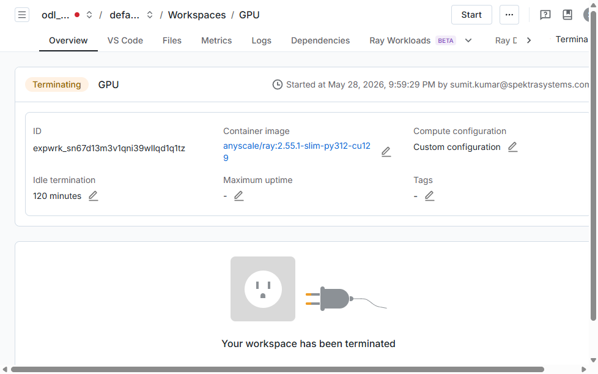

# Anyscale Platform Lab Guide

## Prerequisites

Before starting this lab, ensure you have the following credentials available from the **Environment** tab in your CloudLabs portal:

| Variable | Description |
|---|---|
| `AzureUserName` | Your Azure / Anyscale login email (e.g. `odl_user_XXXXXX@domain.com`) |
| `AzurePassword` | Your Azure / Anyscale login password |
| `ANYSCALE_CLI_TOKEN` | CLI token for Anyscale API access |
| `ANYSCALE_HOST` | Anyscale console URL (`https://console.anyscale.com`) |

---

## Step 1: Log in to the Anyscale Console

1. Open your browser and navigate to **[https://console.anyscale.com](https://console.anyscale.com)**.

2. On the login page, click **Sign in with SSO** or enter your credentials:
   - **Email**: Use the `AzureUserName` from the Environment tab
   - **Password**: Use the `AzurePassword` from the Environment tab

3. After successful authentication, you will be redirected to the Anyscale **Home** page displaying a welcome message.

   

   > You should see **"Hi \<Your Name\>"** along with quick-start cards for submitting jobs and launching workspaces.

---

## Step 2: Navigate to Your Cloud

Your lab environment is pre-configured with a dedicated Anyscale Cloud backed by an Azure AKS cluster with GPU nodes.

1. In the **top navigation bar**, click on the **cloud name** dropdown (shown in the breadcrumb area at the top-left, e.g. `odl_user_XXXXXX_cloud`).

2. A dropdown menu will appear listing all available clouds under your organization. Select your assigned cloud.

   

   > Each cloud is a self-hosted Kubernetes environment. Your cloud name follows the pattern `odl_user_<LabId>_cloud`.

3. Alternatively, you can view all clouds by clicking the **user avatar** (top-right) and selecting **Clouds** from the menu.

   

4. The **Clouds** management page shows all registered clouds, their IDs, deployment dates, and hosting type.

   

---

## Step 3: Select a Workspace

Workspaces are interactive development environments where you can build and debug Ray applications on GPU clusters.

1. After selecting your cloud, click **Workspaces** in the left sidebar navigation.

   

2. The Workspaces page shows all workspaces in the selected cloud and project. You can:
   - **Create** a new workspace using the `+ Create` button
   - **Start** a terminated workspace by selecting it and clicking `Start`
   - **Search** for workspaces by name
   - **Filter** by status, creator, or tags

3. Click on a workspace name (e.g. **GPU**) to open its detail view.

   

4. The workspace detail page shows:
   - **Status**: Running, Terminating, or Terminated
   - **Container image**: The Ray version and Python environment
   - **Compute configuration**: GPU/CPU resources allocated
   - **Tabs**: Overview, VS Code, Files, Metrics, Logs, Dependencies, Ray Workloads

---

## Step 4: Launch and Use a Workspace

1. If your workspace is in **Terminated** state, click the **Start** button to launch it.

2. Once the workspace is **Running**, you can access it via:
   - **VS Code tab**: Opens a browser-based VS Code editor connected to the workspace
   - **Terminal tab**: Provides a web terminal for running commands
   - **JupyterLab**: Available at the workspace URL for notebook-based development

3. The workspace runs on an AKS cluster with:
   - **Head node**: CPU-based node for orchestration
   - **Worker nodes**: GPU nodes (H100) for compute-intensive tasks
   - Automatic scaling based on workload demands

---

## Quick Reference

| Resource | URL |
|---|---|
| Anyscale Console | [https://console.anyscale.com](https://console.anyscale.com) |
| Anyscale Docs | [https://docs.anyscale.com](https://docs.anyscale.com) |
| Workspaces Docs | [https://docs.anyscale.com/platform/workspaces](https://docs.anyscale.com/platform/workspaces) |
| Clouds Docs | [https://docs.anyscale.com/admin/cloud](https://docs.anyscale.com/admin/cloud) |
